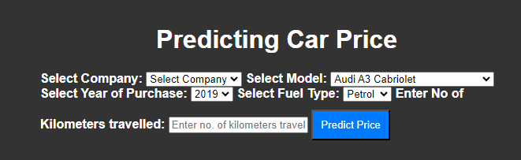
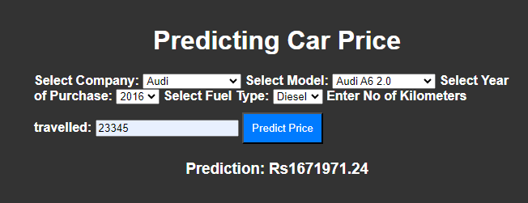

# Car Price Prediction Flask App
This Flask web application predicts the price of car  based on five  factors using Linear Regression model
##Prediction





## Overview

This Flask app is designed to predict the price of a car based on various input parameters such as fuel type, kilometers run, model name, company name, and year. It utilizes a machine learning model to make predictions.

## Features

- **Predict Car Price:** Input the relevant details (fuel type, kilometers run, model name, company name, and year), and the app will predict the price of the car.

- **Supported Fuel Types:** The app supports multiple fuel types, enhancing its versatility.

## Getting Started

### Prerequisites

- Python 3.x
- Install dependencies: `pip install -r requirements.txt`

### Running the App

1. Clone the repository:

   ```bash
   git clone https://github.com/your-username/car-price-prediction-app.git
